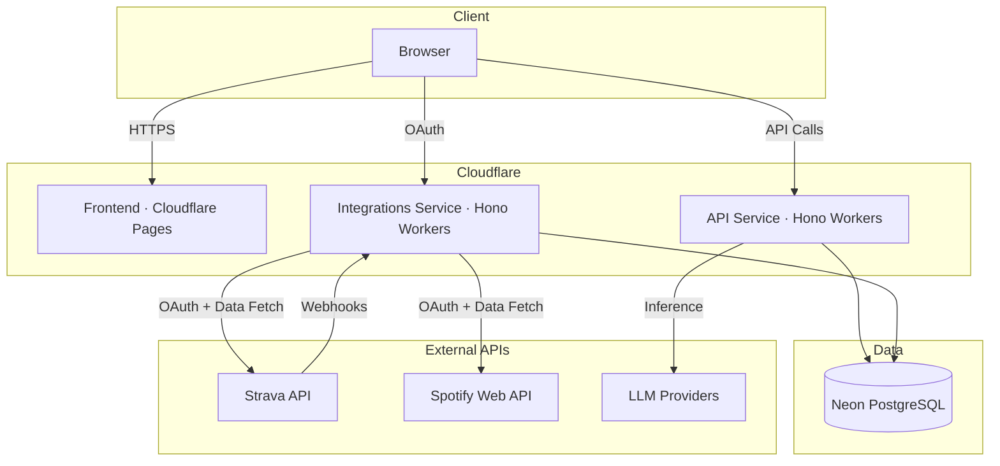

<p align="center">
  <h1 align="center">Tempo-Sync</h1>
  <p align="center">
    A full-stack fitness and music analytics platform that connects your Strava workouts with Spotify listening data to deliver AI-powered performance insights.
  </p>
</p>

<p align="center">
  
  
  
  
  
  
  
</p>

---

<p align="center">
  
</p>

<p align="center">
  
</p>

## About

Tempo-Sync syncs your Strava activity data with your Spotify listening history to surface workout metrics, music-performance correlations, and AI-generated insights. It features interactive map visualization of all your routes, track leaderboards ranked by workout efficiency, and smart playlist recommendations for your next session.

## Features

- **Activity Dashboard** — Detailed metrics for every workout including pace, heart rate, distance, and calories with visual charts
- **AI Performance Insights** — LLM-powered analysis of your activity performance with multi-provider support (OpenAI, Groq, OpenRouter, SambaNova, Cerebras)
- **Track Leaderboard** — Ranks the music you listened to during a workout by efficiency correlation
- **Session Recommendations** — Smart, personalized track suggestions for your next workout based on historical data
- **Global Map** — Interactive map with route polylines and a heatmap mode for visualizing training intensity by location
- **Hex Exploration Grid** — H3 hexagonal overlay on the map showing visited vs unvisited areas with a discovery percentage stat tracking how much of your local area you've explored
- **Strava Sync** — OAuth integration with real-time webhook updates for automatic activity ingestion
- **Spotify Sync** — OAuth integration to pull listening history and audio features for tracks played during workouts
- **Dark Mode** — Light and dark themes with smooth View Transitions API animation, OS preference detection, and localStorage persistence
- **Mobile Responsive** — Gesture-based sidebar navigation with safe area inset support

## Tech Stack

| Layer        | Technology                                                                                            |
| ------------ | ----------------------------------------------------------------------------------------------------- |
| Frontend     | React 19, Vite 7, Emotion, Chakra UI v3, Zustand, TanStack React Query, Motion, Recharts, MapLibre GL |
| Backend      | Hono, Cloudflare Workers                                                                              |
| Database     | PostgreSQL (Neon Serverless), Drizzle ORM                                                             |
| AI / LLM     | OpenAI, Groq, OpenRouter, SambaNova, Cerebras                                                         |
| Integrations | Strava API, Spotify Web API                                                                           |
| Build        | pnpm 9, Turborepo, TypeScript 5.9                                                                     |

## Architecture



## Getting Started

### Prerequisites

- **Node.js** 20+
- **pnpm** 9 — enable via `corepack enable`
- **PostgreSQL** database — [Neon](https://neon.tech) recommended
- **Strava** developer application — [developers.strava.com](https://developers.strava.com)
- **Spotify** developer application — [developer.spotify.com](https://developer.spotify.com)

### Installation

```bash
# Clone the repository
git clone https://github.com/your-username/tempo-sync.git
cd tempo-sync

# Install dependencies
pnpm install

# Set up environment variables (see Environment Variables below)

# Push database schema
pnpm db:push

# Start all services in development mode
pnpm dev
```

The frontend runs on `http://localhost:5173`, the API on `http://localhost:3000`, and the integrations service on `http://localhost:3100`.

## Project Structure

```
tempo-sync/
├── apps/
│   ├── web/                  # React 19 + Vite frontend
│   ├── api/                  # Hono API (Cloudflare Workers)
│   └── integrations/         # OAuth & webhooks (Cloudflare Workers)
├── packages/
│   ├── db/                   # Drizzle ORM schema & migrations
│   ├── types/                # Shared TypeScript types
│   ├── shared/               # Middleware, errors, utilities
│   ├── llm/                  # LLM provider integrations
│   └── config/               # Shared TypeScript configs
├── scripts/                  # Utility scripts (webhook management)
├── turbo.json                # Turborepo task pipeline
└── pnpm-workspace.yaml       # Workspace configuration
```

## Environment Variables

### Database (`packages/db`)

| Variable       | Description                  |
| -------------- | ---------------------------- |
| `DATABASE_URL` | PostgreSQL connection string |

### Frontend (`apps/web`)

| Variable       | Description      |
| -------------- | ---------------- |
| `VITE_APP_URL` | API base URL     |
| `VITE_MAP_KEY` | MapTiler API key |

### API (`apps/api`)

| Variable                | Description                  |
| ----------------------- | ---------------------------- |
| `DATABASE_URL`          | PostgreSQL connection string |
| `KEY`                   | Application secret key       |
| `SPOTIFY_CLIENT_ID`     | Spotify OAuth client ID      |
| `SPOTIFY_CLIENT_SECRET` | Spotify OAuth client secret  |
| `STRAVA_CLIENT_ID`      | Strava OAuth client ID       |
| `STRAVA_CLIENT_SECRET`  | Strava OAuth client secret   |
| `ALLOWED_ORIGINS`       | Comma-separated CORS origins |

### Integrations (`apps/integrations`)

| Variable                | Description                       |
| ----------------------- | --------------------------------- |
| `DATABASE_URL`          | PostgreSQL connection string      |
| `KEY`                   | Application secret key            |
| `VERIFY_TOKEN`          | Strava webhook verification token |
| `SPOTIFY_CLIENT_ID`     | Spotify OAuth client ID           |
| `SPOTIFY_CLIENT_SECRET` | Spotify OAuth client secret       |
| `SPOTIFY_REDIRECT_URL`  | Spotify OAuth redirect URI        |
| `STRAVA_CLIENT_ID`      | Strava OAuth client ID            |
| `STRAVA_CLIENT_SECRET`  | Strava OAuth client secret        |
| `STRAVA_REDIRECT_URL`   | Strava OAuth redirect URI         |
| `GROQ_API_KEY`          | Groq LLM API key                  |
| `OPENROUTER_API_KEY`    | OpenRouter API key                |
| `SAMBANOVA_API_KEY`     | SambaNova API key                 |
| `CEREBRAS_API_KEY`      | Cerebras API key                  |
| `ALLOWED_ORIGINS`       | Comma-separated CORS origins      |

## Scripts

| Command               | Description                           |
| --------------------- | ------------------------------------- |
| `pnpm dev`            | Start all apps in development mode    |
| `pnpm build`          | Build all apps and packages via Turbo |
| `pnpm lint`           | Run ESLint across the monorepo        |
| `pnpm lint:fix`       | ESLint with auto-fix                  |
| `pnpm format`         | Format with Prettier                  |
| `pnpm check-types`    | TypeScript type checking              |
| `pnpm db:studio`      | Launch Drizzle Studio (database UI)   |
| `pnpm deploy`         | Deploy all apps                       |
| `pnpm strava:webhook` | Manage Strava webhook subscriptions   |

## Acknowledgments

Built with data from [Strava](https://www.strava.com) and [Spotify](https://www.spotify.com).

## License

All rights reserved. This project is not open source.
